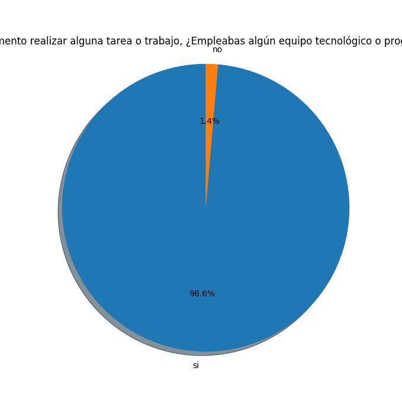

# Analisis de resultados Stay Home

Este documento tiene el objetivo de hacer un analisis estadistico de los resultados obtenidos en las encuestas realizadas por el equipo de Stay Home. Dicha encuesta puede ser encontrada en el siguiente link: https://docs.google.com/forms/d/14wh0bNK3MSg3WY8v24V-g8bWXihrTHVPKeyv0MWj63Y/edit#responses

## Pregunta 1

En el caso de la primera pregunta, dejamos que fuese una pregunta abierta con el afan de conocer un poco mas a nuestro publico objetivo. Tales respondieron de una manera muy interesante, sin embargo, haciendo un analisis estadistico, estos serian los resultados:

## Pregunta 2 y 3

A simple vista, se puede apreciar que la mayoria de usuarios utilizan la computadora a la hora de realizar sus tareas o proyectos a pesar de tener respuestas mixtas a la hora del uso del internet. Esto nos indica que tales usuarios objetivos sacarian mas provecho de una plataforma web para acomodarlo a sus necesidades.

## Pregunta 4, 5, 6 y 7

El resultado nos indica que la mayor de las preocupaciones a la hora de hacer tareas, es por mucho la busqueda de informacion confiable y el tiempo que se tarda el usuario en encontrarla, lo que nos guia a orientar nuestra plataforma a limitar las descargas a sitios que sean validados y confiables, lo cual optimizaria su tiempo de busqueda de articulos de utilidad.

## Pregunta 8 y 9

Podemos observar que, tras explicar al usuario lo que trata de hacer Stay Home, este se muestra muy interesado y siente que tendria confianza de una plataforma que pueda ofrecer contenido de calidad.

## Pregunta 10

Finalmente, preguntamos a los usuarios que features son los que le gustaria tener en tal plataforma y que otros features nuevos esperarian.

