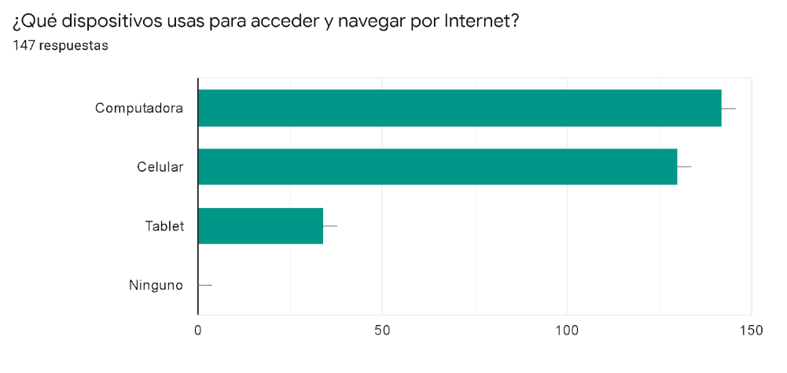
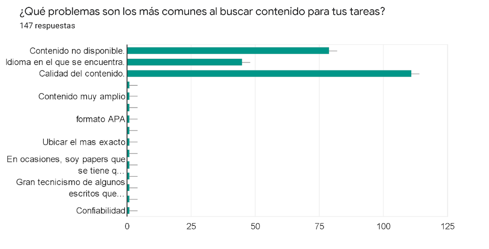
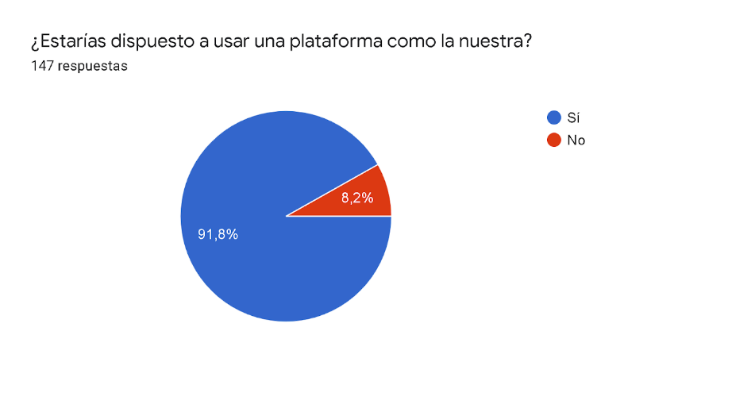

# Análisis de resultados Stay Home

Este documento tiene el objetivo de hacer un análisis estadístico de los resultados obtenidos en las encuestas realizadas por el equipo de Stay Home. Dicha encuesta puede ser encontrada en el siguiente link: https://docs.google.com/forms/d/14wh0bNK3MSg3WY8v24V-g8bWXihrTHVPKeyv0MWj63Y/edit#responses

## Pregunta 1

En el caso de la primera pregunta, dejamos que fuese una pregunta abierta con el afan de conocer un poco mas a nuestro publico objetivo. Tales respondieron de una manera muy interesante, sin embargo, haciendo un analisis estadistico, estos serian los resultados:

## Pregunta 2 y 3

A simple vista, se puede apreciar que la mayoria de usuarios utilizan la computadora a la hora de realizar sus tareas o proyectos a pesar de tener respuestas mixtas a la hora del uso del internet. Esto nos indica que tales usuarios objetivos sacarian más provecho de una plataforma web para acomodarlo a sus necesidades.

## Pregunta 4, 5, 6 y 7

El resultado nos indica que la mayor de las preocupaciones a la hora de hacer tareas, es por mucho la búsqueda de información confiable y el tiempo que se tarda el usuario en encontrarla, lo que nos guía a orientar nuestra plataforma a limitar las descargas a sitios que sean válidados y confiables, lo cual optimizaría su tiempo de búsqueda de artículos de utilidad.

## Pregunta 8 y 9

Podemos observar que, tras explicar al usuario lo que trata de hacer Stay Home, este se muestra muy interesado y siente que tendría confianza de una plataforma que pueda ofrecer contenido de calidad.

## Pregunta 10

Finalmente, preguntamos a los usuarios que features son los que le gustaria tener en tal plataforma y que otros features nuevos esperarían.

